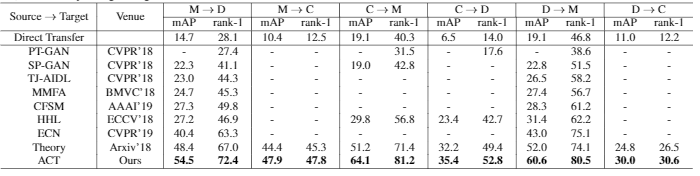

# Asymmetric Co-Teaching for Unsupervised Cross Domain Person Re-Identification (AAAI 2020)

Code for AAAI 2020 paper [Asymmetric Co-Teaching for Unsupervised Cross Domain Person Re-Identification](https://arxiv.org/abs/1912.01349).



## Requirements
* python 3.7
* Server with 4 GPUs
* Market1501, DukeMTMC-reID and other datasets.
* Other necessary packages listed in requirements.txt

## Adaptation with ACT
1. Download all necessary datasets and move them to 'data' by following instructions in 'data/readme.md'

2. If you want to train from the pre-adapted model for fast reproduction, 
please download all models in <a href="#jump">Resources</a> and run the following command:

```
python selftrainingACT.py  --src_dataset {src_dataset_name} --tgt_dataset {tgt_dataset_name} --resume {model's path} --data_dir ./data --logs_dir {path to save model}
```

avaliable choices to fill "src_dataset_name" and "tgt_dataset_name" are: 
market1501 (for Market1501), dukemtmc (for DukeMTMC-reID), cuhk03 (for CUHK03).


3. If you want to train from scratch, please train source model and adapted model by using code in 
[Adaptive-ReID](https://github.com/LcDog/DomainAdaptiveReID) and follow #2.

## Adaptation with other structures using co-teaching.
To reproduce the results in Tab. 2 of our paper, please run selftrainingRCT.py and selftrainingCT.py in similar way.

## Adaptation with other clustering methods.
To reproduce Tab.3 of our paper, run selftrainingKmeans.py (co-teaching version) and selftrainingKmeansAsy.py (ACT version).

If you find this code useful in your research, please consider citing:
```
@article{yang2020asy,
  title={Asymmetric Co-Teaching for Unsupervised Cross Domain Person Re-Identification},
  author={Yang, Fengxiang and Li, Ke and Zhong, Zhun and Luo, Zhiming and Sun, Xing and Cheng, Hao and Guo, Xiaowei and Huang, Feiyue and Ji, Rongrong and Li, Shaozi},
  booktitle={AAAI},
  year={2020}
}
```

## Acknowlegments
Our code is based on [open-reid](https://github.com/Cysu/open-reid) and [Adaptive-ReID](https://arxiv.org/abs/1807.11334), 
if you use our code, please also cite their paper.
```
@article{song2018unsupervised,
  title={Unsupervised domain adaptive re-identification: Theory and practice},
  author={Song, Liangchen and Wang, Cheng and Zhang, Lefei and Du, Bo and Zhang, Qian and Huang, Chang and Wang, Xinggang},
  journal={arXiv preprint arXiv:1807.11334},
  year={2018}
}
```


<h2 id="jump">Resouces:</h2>

1. Pretrained Models:

all pre-adapted models are named by the following formula:
```
ada{src}2{tgt}.pth
```
where "src" and "tgt" are the initial letter of source and target dataset's name, i.e., M for Market1501, D for Duke and C for CUHK03. 

[Baidu NetDisk](https://pan.baidu.com/s/1uPjKpkdZjqSJdk3XxR1-Yg), Password: 9aba

[Google Drive](https://drive.google.com/file/d/1W1BcmHjmzxR3TVj2rFpnV703Huat3AeA/view?usp=sharing)